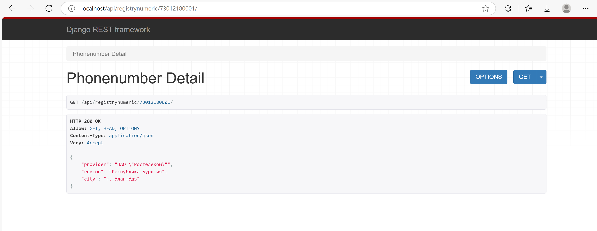

## Внимание

Прект для разработки создан на основе docker-контейнеров

Проект не готов для выкатки в прод, так как конечные задачи и нагрузка не определена:
* Не отключен режим дебага
* На бэке джанга запущена standalone, а не через uwsgi(asgi) демон
* Не отключены все неиспользуемы мидлвари
* Не оттюнен под нагрузку нжинкс
* Не настроена система логирования
* etc

## Контейнеры

### postgres
База на основе образа `postgres:17.4-alpine3.21`

`./docker/postgres` :
* `.env.dev` - дев конфиг переменных окружения

### nginx
Контейнер фронта на основе образа `nginx:stable-alpine`

`./docker/nginx` :
* `dev/nginx.conf` - дев конфиг

### back
Контейнер на основе `python:3.13.2-alpine3.21`

`./docker/back` :

* `.env.dev` - дев конфиг переменных окружения
* `crontab.cron` - примерный конфиг для прода
* `requiments.txt` - python модули проекта
* `Dockerfile` - pip модули проекта

#### Эндпоинты

На бэкенде реализован один эндпоинт:

`/api/registrynumeric/73012180001/`

Подразумевается, что бэк реализует только REST Api,
а html-форма и валидация формы будет вынесена на react

Номер телефона принимается напрямую в урле.
В случае успеха, возвращает json:
```json
{
    'provider': 'ПАО "Ростелеком"',
    'city': 'г. Улан-Удэ',
    'region': 'Республика Бурятия'
}
```

В случае отсутсвия данных в базе, возвращает 404

В случае ошибки в номере, тоже возвращается 404




#### Manage скрипты

`registrynumeric/management/commans/update_registry.py`:

Реализует загрузку данных с реестра минцифры.
Обновление данных реализовано в атомарной транзакции.
На ноутбуке в докер контейнере загрузка занимает 40 минут.

### Тесты

`registrynumeric/tests/test_loader.py` - Тестирует скрипт загрузки

`registrynumeric/tests/test_api.py` - Тестирует api эндпоинт
